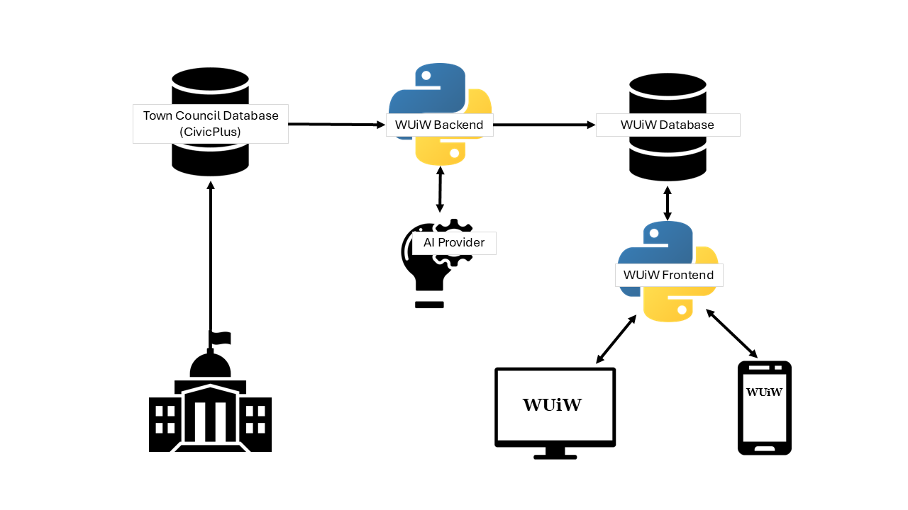

# Welcome to the WUiW Docs
*What's Up in Windsor* is an online civic archive, built to help busy residents stay informed on local government decisions.

## System Architecture
The intent is to make it easier for residents to follow the, lets be honest: less-than-enthralling proceedings of local government. How? 

1. It requests official meeting documents (minutes, agendas, etc.) from the town's web host.
2. It downloads the text and sends it to a Large Language Model for summarization.
3. It stores the summary in a local WUiW database.
4. Then, the summaries are posted to [whatsupinwindsor.com](https://whatsupinwindsor.com) for easy reader digest.

::: wuiw.main.main

---
See the API refereence for details, and visit [www.whatsupinwindsor.com](https://whatsupinwindsor.com) to find out what happened at the last town council meeting in 2 minutes or less.